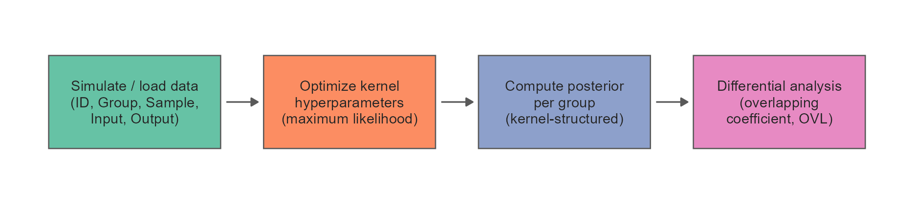
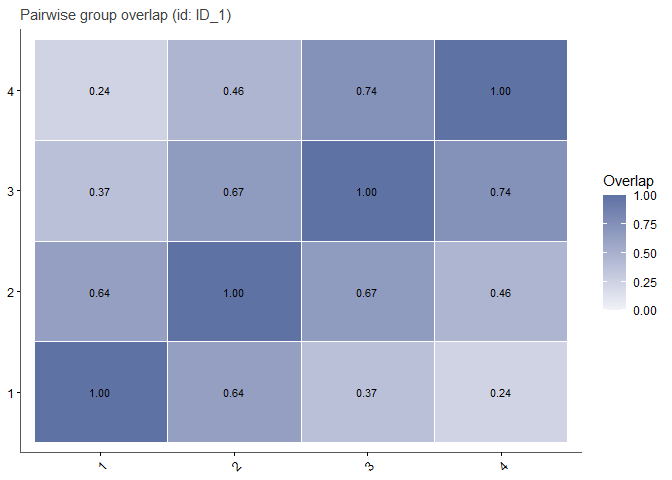
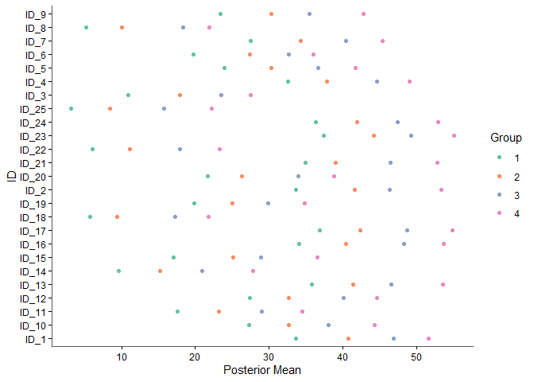

<!-- README.md is generated from README.Rmd. Please edit that file -->

# BayesOmics <a href="https://terenceviellard.github.io/BayesOmics/"></a>

<!-- badges: start -->

[](https://github.com/terenceviellard/BayesOmics/actions/workflows/pkgdown.yml)
<!-- badges: end -->

BayesOmics is an R package for Bayesian differential analysis of omics
data. It places a kernel over the feature dimension (genomic position,
mass-to-charge ratio, retention time, …) to capture correlation
structure, fits that kernel by maximum likelihood, and computes a
posterior profile per group. Groups are then compared as complete
multivariate profiles via an overlapping coefficient (OVL), giving a
single, interpretable differential-analysis statistic per region.



## When to use BayesOmics

BayesOmics is designed for datasets where features are not independent
but share a meaningful ordering or distance along some axis — genomic
position, retention time, dose level, time point, m/z ratio, or any
other continuous covariate. Classical per-feature tests (t-test, limma)
ignore that structure and multiply the number of comparisons. BayesOmics
instead models the whole region jointly: it fits a kernel over the
feature axis to capture the correlation pattern, then derives one
posterior profile per group and compares groups as complete multivariate
objects via a single overlapping coefficient (OVL).

Typical use cases:

- **Longitudinal / time-course** omics: features ordered by time point
  or dose
- **Spatial genomics**: features ordered by chromosomal position
  (methylation, ChIP-seq, ATAC-seq)
- Any experiment where the signal is expected to vary smoothly across
  the feature axis

## Key assumptions

- Every group must be measured at the **same set of Input values** (same
  feature positions) so that groups share one kernel matrix and can be
  compared.
- Within a group, every feature (`ID`) must have the **same number of
  replicates** (`Sample`).
- Groups being compared must cover the **same set of IDs**.Groups may
  have different numbers of replicates.

See `vignette("troubleshooting")` for the exact error raised when these
conditions are not met.

## Installation

``` r
# install.packages("pak")
pak::pak("terenceviellard/BayesOmics")
```

## Dependencies

BayesOmics depends on the companion package
[**keRnel**](https://github.com/terenceviellard/keRnel) for kernel
classes, pairwise kernel computation, and hyperparameter management.
Both packages are installed together via
`pak::pak("terenceviellard/BayesOmics")`.

CRAN dependencies: `mvtnorm`, `ggplot2`, `dplyr`, `gridExtra`.

## See it in action

Five lines from raw data to posterior comparison:

``` r
library(keRnel)
library(BayesOmics)

set.seed(42)
data <- simu_db(nb_id = 25, nb_group = 4, nb_sample = 3, diff_group = 8)

kern         <- variance_kernel(variance = 1) * se_kernel(length_scale = 1)
control_data <- data[data$Group == 1, ]
opt          <- fit_kernel(kern, control_data,
                         prior_mean = mean(control_data$Output), prior_cov = 1)
kern         <- do.call(kupdate, c(list(kern), as.list(opt)))

posterior <- posterior_mean(data, kern)
group_diff(posterior)
#> Metric: per_feature_metric(wasserstein_metric(), power = 0.5) 
#> 
#>           1         2         3         4
#> 1  0.000000  6.031284 12.129416 17.615459
#> 2  6.031284  0.000000  6.264025 11.704798
#> 3 12.129416  6.264025  0.000000  5.600068
#> 4 17.615459 11.704798  5.600068  0.000000
samples   <- sample_posterior(posterior, n = 2000)
```

Pairwise OVL between every group for one feature (lower = more
differentiated):

``` r
plot_group_overlap_heatmap(samples, id = unique(samples$ID)[1])
```



Posterior mean at every feature, coloured by group:

``` r
plot_posterior_mean(samples)
```



## Go further

| Vignette | What you will find |
|----|----|
| `vignette("get-started")` | Data format, kernel choice, step-by-step pipeline, and basic plots — the right place to start. |
| `vignette("01_basic_pipeline")` | The complete two-group walkthrough - kernel choice, hyperparameter fitting, posterior computation, `group_diff()`. |
| `vignette("04_multi_group")` | Reading a `group_diff()` matrix and `plot_multi_diff()` output for more than two groups (e.g. a dose-response design). |
| `vignette("07_unequal_sample_size")` | How unbalanced designs affect posterior width and the OVL, and why the comparison remains valid with unequal sample sizes. |
| `vignette("troubleshooting")` | Exact error messages you may encounter, what causes each of them, and the targeted fix. |
