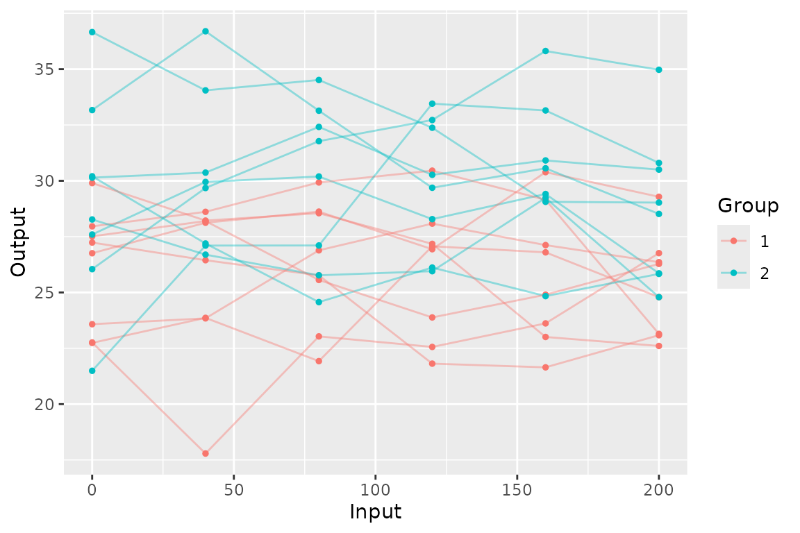
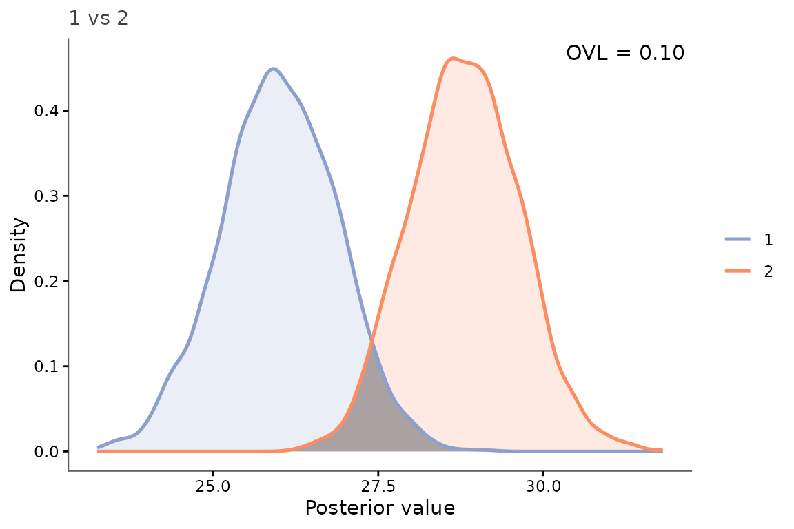
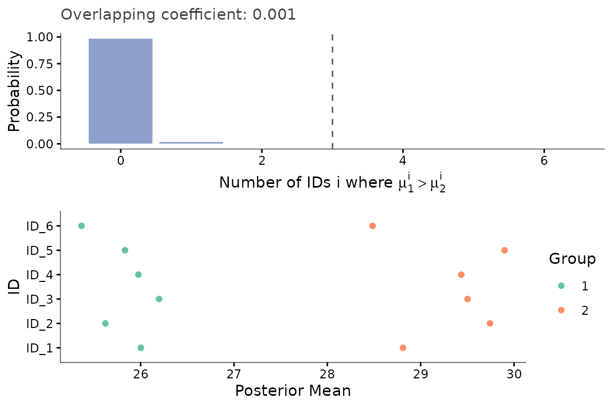

# 01 · Basic pipeline: comparing two groups with a spatial kernel

``` r

library(keRnel)
library(BayesOmics)
library(ggplot2)
```

You have two groups, one covariate (`Input`), for instance time, per
feature, and want to know whether – and where – the groups differ. This
is the shortest path through the full pipeline: simulate, fit, compare,
visualize.

## Simulate

``` r

set.seed(1)
kern_true <- variance_kernel(variance = 10) * se_kernel(length_scale = 100)
data <- simu_db_kernel(
  kernel        = kern_true,
  nb_id         = 6,
  nb_group      = 2,
  nb_sample     = 8,
  diff_group    = 3,
  var_sample    = 3,
  range_input   = c(0, 200),
  integer_input = TRUE,
  input_grid    = TRUE
)
head(data)
#>     ID Group Sample Input_ID Input   Output
#> 1 ID_1     1      1        1     0 22.74129
#> 2 ID_2     1      1        1    40 23.86233
#> 3 ID_3     1      1        1    80 21.92447
#> 4 ID_4     1      1        1   120 27.06826
#> 5 ID_5     1      1        1   160 26.79674
#> 6 ID_6     1      1        1   200 24.78897
```

``` r

ggplot(data, aes(Input, Output, color = Group, group = interaction(Group, Sample))) +
  geom_line(alpha = 0.4) +
  geom_point(size = 1)
```



Each line is one replicate; the two groups’ vertical offset is the
differential signal the rest of this example tries to recover and
quantify.

## Fit the kernel

A Squared Exponential (SE) term captures spatial correlation; a
white-noise term absorbs measurement noise and keeps the resulting
covariance well-conditioned (see the kernel-choice article for other
kernels and why the noise term matters):

``` r

kern <- variance_kernel(variance = 1) * se_kernel(length_scale = 50) +
  white_noise_kernel(noise = 1)

group1     <- data[data$Group == unique(data$Group)[1], ]
prior_mean <- mean(group1$Output)
hp_opt     <- fit_kernel(kern, group1, prior_mean = prior_mean, prior_cov = 1)
kern_opt   <- kupdate(kern,
                       variance     = hp_opt[["variance"]],
                       length_scale = hp_opt[["length_scale"]],
                       noise        = hp_opt[["noise"]])
```

## Compute posteriors and compare

``` r

posterior <- posterior_mean(data, kern_opt, mu_0 = prior_mean, lambda_0 = 1)
group_diff(posterior)
#> Metric: ovl_metric(n_mc = 2000) 
#> 
#>             1           2
#> 1 1.000000000 0.001360574
#> 2 0.001360574 1.000000000
```

The Overlapping Coefficient (OVL) ranges from 1 (identical posteriors,
no differential signal) to 0 (fully separated, strong differential
signal).

## Visualize one feature

``` r

samples <- sample_posterior(posterior, n = 2000)
plot_posterior_overlap(samples,
                        group1 = unique(samples$Group)[1],
                        group2 = unique(samples$Group)[2],
                        id     = unique(samples$ID)[1])
```



The shaded region is exactly what the OVL number above quantifies for
that feature.

## How many features differ?

The single-feature view above does not say whether the difference is
localized or spread across the whole region.
[`compute_multi_diff()`](https://terenceviellard.github.io/BayesOmics/reference/compute_multi_diff.md)
answers that from the posterior draws: the empirical probability that
group 1 exceeds group 2 on `k` out of the 6 features, plotted by
[`plot_multi_diff()`](https://terenceviellard.github.io/BayesOmics/reference/plot_multi_diff.md)
alongside every feature’s posterior mean:

``` r

multi_diff <- compute_multi_diff(samples, results = posterior)
plot_multi_diff(multi_diff)
```



The bar chart is concentrated almost entirely at `k = 0` (over 98% of
the probability mass), not spread uniformly across `0`-`6`: on almost
every feature, group 2’s draw exceeds group 1’s. This is what a clear,
consistent differential signal looks like – not just a low joint OVL,
but the same direction of effect on nearly every feature.

## Takeaways

- The pipeline is always four calls:
  [`fit_kernel()`](https://terenceviellard.github.io/BayesOmics/reference/fit_kernel.md)
  -\>
  [`posterior_mean()`](https://terenceviellard.github.io/BayesOmics/reference/posterior_mean.md)
  -\>
  [`group_diff()`](https://terenceviellard.github.io/BayesOmics/reference/group_diff.md)
  -\> a plot function.
- This example fixes every other variable: two groups, one covariate, a
  kernel shared across groups. Each is relaxed in a separate article.

## Related

[Univariate
mode](https://terenceviellard.github.io/BayesOmics/articles/02_univariate.md)
(no covariate at all) – [Pooled vs. non-pooled
fitting](https://terenceviellard.github.io/BayesOmics/articles/04_pooled_vs_nonpooled.md)
(one kernel per group) – [Comparing more than two
groups](https://terenceviellard.github.io/BayesOmics/articles/05_multi_group.md).
