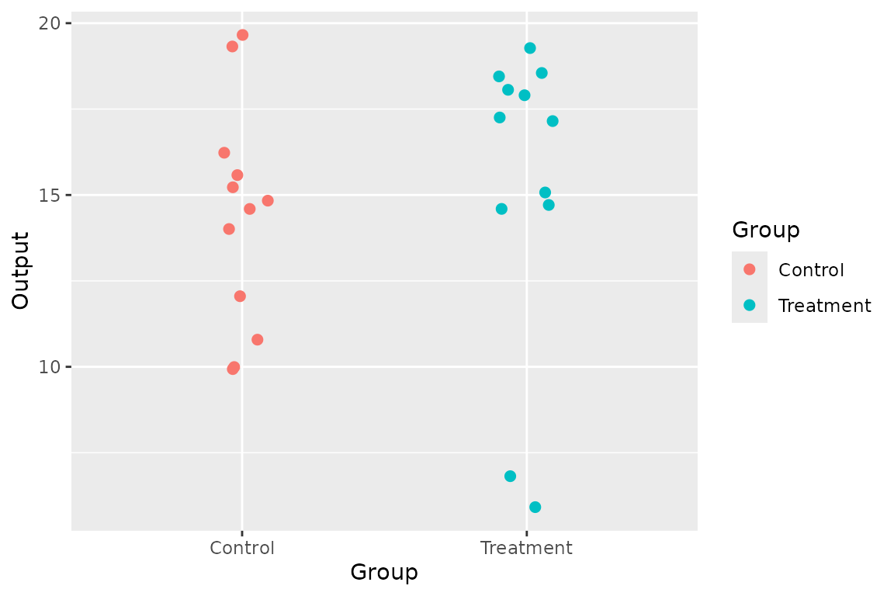
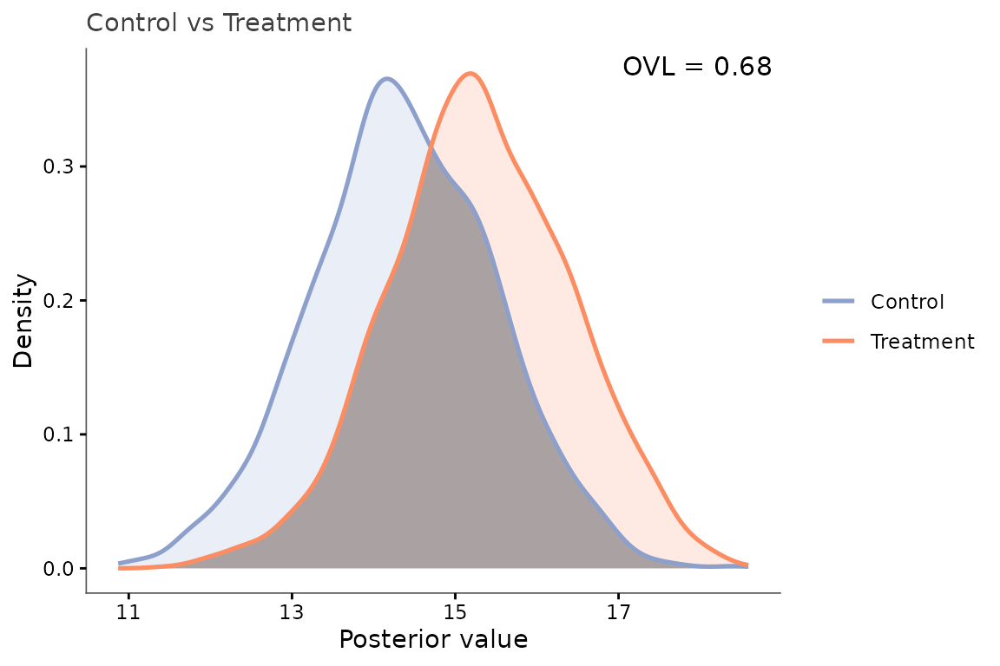

# Univariate mode: comparing two groups with no feature axis

``` r

library(BayesOmics)
library(ggplot2)
```

You have two groups of replicate measurements on a single quantity – no
feature/covariate axis at all (e.g. one protein’s abundance, or a single
summary score). There is nothing for a kernel to correlate against, so
supplying neither `ID` nor `Input` switches
[`posterior_mean()`](https://terenceviellard.github.io/BayesOmics/reference/posterior_mean.md)
into univariate mode: each group is treated as one feature.

## Data

``` r

set.seed(1)
data <- simu_db(univariate = TRUE, nb_group = 2, nb_sample = 12,
                 diff_group = 1.5, var_sample = 4)
data$Group <- factor(data$Group, levels = c(1, 2), labels = c("Control", "Treatment"))
head(data)
#>     Group Sample    Output
#> 1 Control      1 14.010006
#> 2 Control      2  9.932919
#> 3 Control      3 19.656556
#> 4 Control      4 14.593464
#> 5 Control      5  9.993560
#> 6 Control      6 15.225149
```

``` r

ggplot(data, aes(Group, Output, color = Group)) +
  geom_jitter(width = 0.1, size = 2)
```



## Fit and compare

No `kern` is supplied either: with a single feature per group,
[`posterior_mean()`](https://terenceviellard.github.io/BayesOmics/reference/posterior_mean.md)
fits a closed-form residual-variance kernel itself.

``` r

posterior <- posterior_mean(data, mu_0 = mean(data$Output), lambda_0 = 1)
#> Warning in inject_univariate_dummy_cols(data, "posterior_mean"):
#> posterior_mean(): no 'ID'/'Input' columns found in 'data' -- running in
#> univariate mode (each group treated as a single feature, no cross-feature
#> correlation structure).
group_diff(posterior)
#> Metric: ovl_metric(n_mc = 2000) 
#> 
#>             Control Treatment
#> Control   1.0000000 0.6814076
#> Treatment 0.6814076 1.0000000
```

The warning above (“running in univariate mode…”) is expected – it
confirms the mode switch rather than signalling a mistake.

## Visualize the difference

With a single feature per group,
[`plot_posterior_overlap()`](https://terenceviellard.github.io/BayesOmics/reference/plot_posterior_overlap.md)
shows exactly what the OVL number summarizes: both groups’ posterior
densities, with the region of overlap shaded:

``` r

samples <- sample_posterior(posterior, n = 2000)
plot_posterior_overlap(samples, group1 = "Control", group2 = "Treatment",
                        id = unique(samples$ID)[1])
```



## Takeaways

- Univariate mode needs both `ID` and `Input` *absent*, not just one of
  them.
- Everything downstream
  ([`group_diff()`](https://terenceviellard.github.io/BayesOmics/reference/group_diff.md),
  the metric family, the plots) works unchanged – a single feature is
  just a group with `nb_id = 1`.

## Related

*Basic pipeline* (the general multi-feature case) – *Pooled
vs. non-pooled fitting*.
