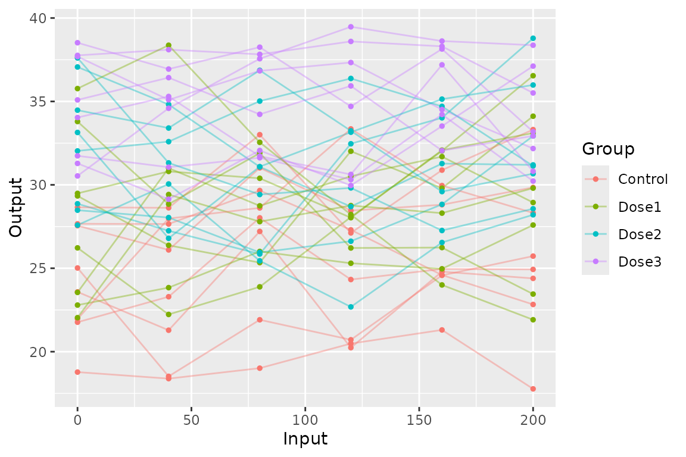
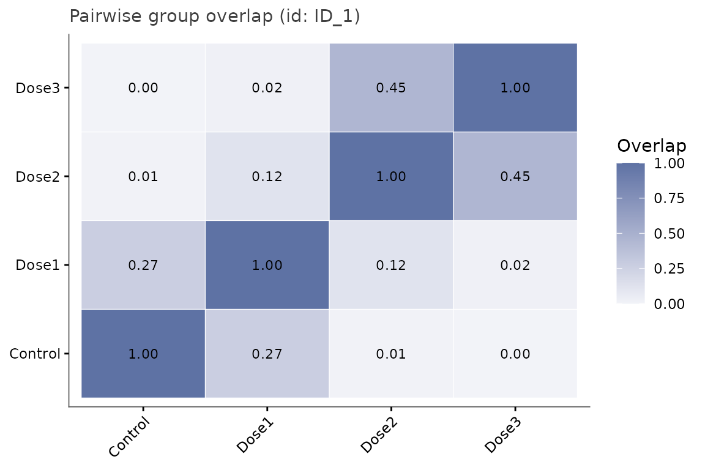
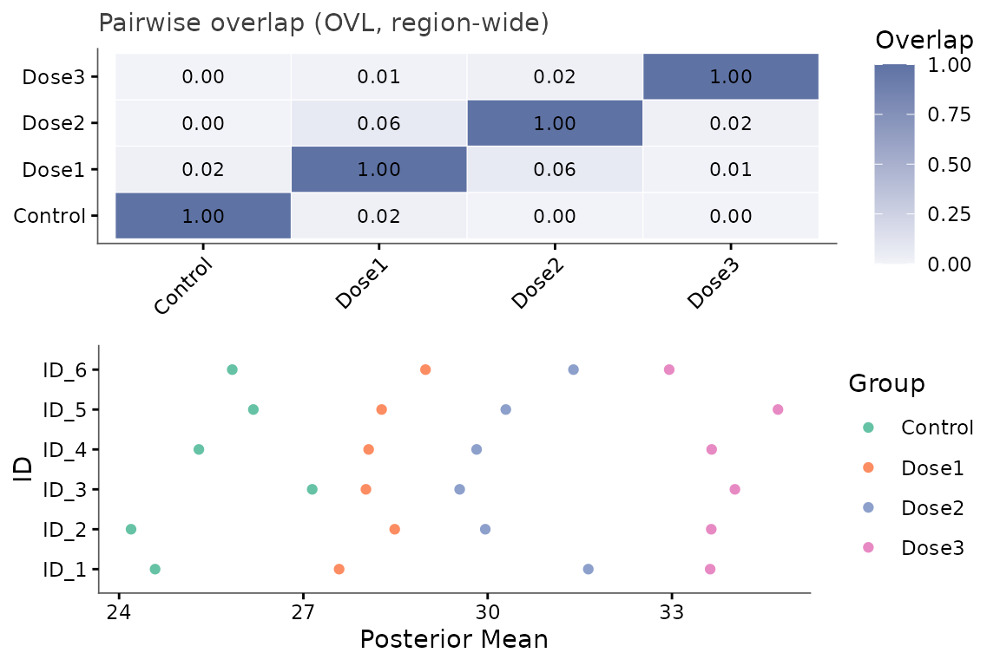
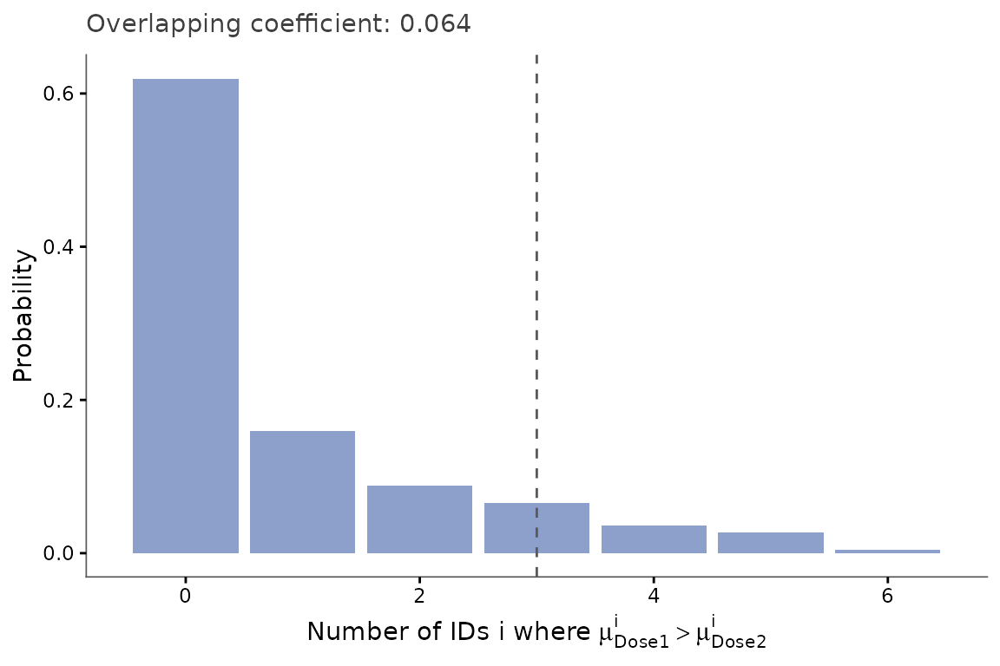

# Comparing more than two groups

``` r

library(keRnel)
library(BayesOmics)
library(ggplot2)
```

Nothing in the pipeline changes when there are more than two groups:
every function below is the same call as in the two-group case. What
changes is how to read the result – a `g x g` matrix instead of a single
number, and a compact plot to go with it. A four-arm dose-response
design, where two doses happen to produce the same effect:

## Simulate and fit

``` r

set.seed(2)
kern_true <- variance_kernel(variance = 10) * se_kernel(length_scale = 80)
data <- simu_db_kernel(
  kernel        = kern_true,
  nb_id         = 6,
  nb_group      = 4,
  nb_sample     = 8,
  diff_group    = c(0, 5, 5, 10),
  var_sample    = 3,
  range_input   = c(0, 200),
  group_labels  = c("Control", "Dose1", "Dose2", "Dose3"),
  integer_input = TRUE,
  input_grid    = TRUE
)

kern <- variance_kernel(variance = 1) * se_kernel(length_scale = 50) +
  white_noise_kernel(noise = 1)
g1         <- data[data$Group == "Control", ]
prior_mean <- mean(g1$Output)
hp_opt     <- fit_kernel(kern, g1, prior_mean = prior_mean, prior_cov = 1)
kern_opt   <- kupdate(kern,
                       variance     = hp_opt[["variance"]],
                       length_scale = hp_opt[["length_scale"]],
                       noise        = hp_opt[["noise"]])
posterior  <- posterior_mean(data, kern_opt, mu_0 = prior_mean, lambda_0 = 1)
```

``` r

ggplot(data, aes(Input, Output, color = Group, group = interaction(Group, Sample))) +
  geom_line(alpha = 0.4) +
  geom_point(size = 1)
```



`Dose1` and `Dose2` visually overlap across most of the region, while
`Control` and `Dose3` sit clearly apart – the same pattern the pairwise
matrix below quantifies.

## Read the pairwise matrix

``` r

group_diff(posterior)
#> Metric: ovl_metric(n_mc = 2000) 
#> 
#>              Control       Dose1        Dose2        Dose3
#> Control 1.000000e+00 0.024636032 0.0004850454 4.566015e-05
#> Dose1   2.463603e-02 1.000000000 0.0638252788 5.258266e-03
#> Dose2   4.850454e-04 0.063825279 1.0000000000 1.830146e-02
#> Dose3   4.566015e-05 0.005258266 0.0183014611 1.000000e+00
```

The matrix is symmetric with 1s on the diagonal. Read it row/column by
row/column: `Dose1`-`Dose2` stands out as the least separated
off-diagonal pair (OVL ~ 0.064, clearly the largest off-diagonal value),
consistent with both having the same simulated effect (`diff_group = 5`)
– every other pair is well separated.

## One-feature heatmap

For a single feature, the same information is a small `g x g` tile plot
– useful once you want to compare many features’ matrices side by side
rather than reading numbers:

``` r

samples <- sample_posterior(posterior, n = 2000)
plot_group_overlap_heatmap(samples, id = unique(samples$ID)[1])
```



## Every pairwise comparison at once

[`plot_multi_diff()`](https://terenceviellard.github.io/BayesOmics/reference/plot_multi_diff.md)
is not capped at two groups either. With more than two groups it shows
an at-a-glance overview immediately (a heatmap, one tile per pair, plus
the per-feature posterior-mean panel) and returns every individual
pair’s full panel for inspection on demand – no cap, never crammed into
one shared grid:

``` r

multi_diff <- compute_multi_diff(samples, results = posterior)
out <- plot_multi_diff(multi_diff)  # displays the heatmap + mean panel above
```



``` r

out$pairs[["Dose1_vs_Dose2"]]
```



`Dose1`-`Dose2` is the one panel closest to a uniform spread across
`0`-`6`; every other pair leans toward one extreme, matching the heatmap
above.

## Takeaways

- [`group_diff()`](https://terenceviellard.github.io/BayesOmics/reference/group_diff.md)/[`compute_group_diff()`](https://terenceviellard.github.io/BayesOmics/reference/compute_group_diff.md)
  return a full `g x g` matrix for any number of groups – there is no
  special two-group code path.
- Groups with the same underlying effect show up directly as a small
  pairwise distance, without needing a separate equivalence test.
- [`plot_multi_diff()`](https://terenceviellard.github.io/BayesOmics/reference/plot_multi_diff.md)’s
  heatmap is a quick overview, not the final word: at enough features,
  OVL saturates there just as it does everywhere else – drill into
  `out$pairs[[...]]` (or use
  [`group_diff()`](https://terenceviellard.github.io/BayesOmics/reference/group_diff.md)’s
  own default) for the informative view.

## Related

*Basic pipeline* – *Pooled vs. non-pooled fitting* – *Analysis with a
block-diagonal partition* (for many features across many groups).
