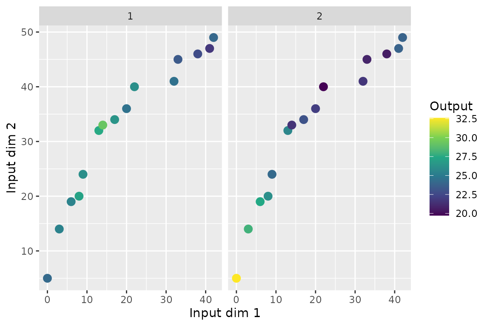

# 09 · Input with more than one dimension

``` r

library(keRnel)
library(BayesOmics)
library(ggplot2)
```

Every example so far has one covariate per feature (e.g. genomic
position). When a feature is located by more than one covariate at once
(e.g. position *and* measurement time), `Input` is no longer a single
value per `(Group, ID, Sample)`: it becomes one row per `Input_ID`, with
`Output` repeated identically across those rows.

## Data layout

``` r

set.seed(1)
kern_true <- variance_kernel(variance = 10) * se_kernel(length_scale = 20)
data <- simu_db_kernel(kernel = kern_true, nb_id = 15, nb_group = 2, nb_sample = 10,
                        nb_dim = 2, diff_group = 0.8, var_sample = 3, range_input = c(0, 50),
                        integer_input = TRUE)
data[data$ID == "ID_1" & data$Sample == 1, ]
#>       ID Group Sample Input_ID Input   Output
#> 1   ID_1     1      1        1     0 24.19139
#> 16  ID_1     1      1        2     5 24.19139
#> 301 ID_1     2      1        1     0 32.58991
#> 316 ID_1     2      1        2     5 32.58991
```

One observation of `ID_1` is now two rows, `Input_ID = 1` and
`Input_ID = 2`, sharing the same `Output`.

``` r

wide <- reshape(data[data$Sample == 1, ], idvar = c("ID", "Group"),
                 timevar = "Input_ID", direction = "wide")
ggplot(wide, aes(Input.1, Input.2, color = Output.1)) +
  geom_point(size = 3) +
  facet_wrap(~Group) +
  scale_color_viridis_c() +
  labs(x = "Input dim 1", y = "Input dim 2", color = "Output")
```



Each feature is now a point in a 2D plane, not a position on a line –
`Input.1`/`Input.2` place it, `Output.1` (identical to `Output.2`)
colors it.

## Why no code change is needed: the kernel factorizes

An isotropic SE kernel’s squared Euclidean distance decomposes as a sum
across dimensions, so the kernel value (its exponential) factorizes as a
product. On a Cartesian grid of positions, that turns the joint 2D
kernel matrix into the Kronecker product of the two per-axis 1D kernel
matrices – this is exactly why
[`posterior_mean()`](https://terenceviellard.github.io/BayesOmics/reference/posterior_mean.md)/[`fit_kernel()`](https://terenceviellard.github.io/BayesOmics/reference/fit_kernel.md)
need no dimension-aware code path, only the extra `Input_ID` axis in the
data:

``` r

axis1  <- seq(0, 50, by = 10)
axis2  <- seq(0, 60, by = 15)
kern1d <- se_kernel(length_scale = 15)
K1 <- evaluate(kern1d, matrix(axis1, ncol = 1), matrix(axis1, ncol = 1))
K2 <- evaluate(kern1d, matrix(axis2, ncol = 1), matrix(axis2, ncol = 1))
K_kron <- kronecker(K2, K1)
```

``` r

mat_df <- as.data.frame(as.table(K_kron))
names(mat_df) <- c("Row", "Col", "Value")
ggplot(mat_df, aes(Row, Col, fill = Value)) +
  geom_tile() +
  scale_fill_gradient(low = "white", high = "#5E72A4") +
  labs(title = "kronecker(K2, K1): the 2D grid kernel matrix", x = NULL, y = NULL) +
  theme(axis.text = element_blank(), axis.ticks = element_blank())
```


## Fit and compare – same calls

An isotropic kernel (a single `length_scale` applied to the Euclidean
distance across both dimensions) needs no code change at all: only the
data has an extra `Input_ID` axis.

``` r

kern <- variance_kernel(variance = 1) * se_kernel(length_scale = 5) +
  white_noise_kernel(noise = 1)
g1         <- data[data$Group == unique(data$Group)[1], ]
prior_mean <- mean(g1$Output)
hp_opt     <- fit_kernel(kern, g1, prior_mean = prior_mean, prior_cov = 1)
hp_opt
#>     variance length_scale        noise 
#>     8.120222    15.647368     1.216915 
#> attr(,"convergence")
#> [1] 0
#> attr(,"value")
#> [1] 325.0137
```

``` r

kern_opt  <- kupdate(kern,
                      variance     = hp_opt[["variance"]],
                      length_scale = hp_opt[["length_scale"]],
                      noise        = hp_opt[["noise"]])
posterior <- posterior_mean(data, kern_opt, mu_0 = prior_mean, lambda_0 = 1)
group_diff(posterior)
#> Metric: per_feature_metric(wasserstein_metric(), power = 0.5) 
#> 
#>          1        2
#> 1 0.000000 1.271579
#> 2 1.271579 0.000000
```

Recovered `length_scale` lands in the same ballpark as the simulated
value (`20`), confirming the kernel is correctly picking up correlation
jointly across both dimensions, not just the first one.

## Takeaways

- Multi-dimensional Input is a data-layout choice (`Input_ID` + repeated
  `Output`), not a different function call.
- On a grid, the isotropic kernel matrix is exactly a Kronecker product
  of the per-axis 1D kernel matrices – the mathematical reason no
  dimension-specific fitting code is needed.
- The starting `length_scale` matters more here than in the 1D case – an
  initial value far from the true scale can stall the optimizer in a
  flat region; start from a value in the right order of magnitude.

## Related

[Basic
pipeline](https://terenceviellard.github.io/BayesOmics/articles/01_basic_pipeline.md)
– [Using a kernel other than
SE](https://terenceviellard.github.io/BayesOmics/articles/08_kernel_choice.md).
