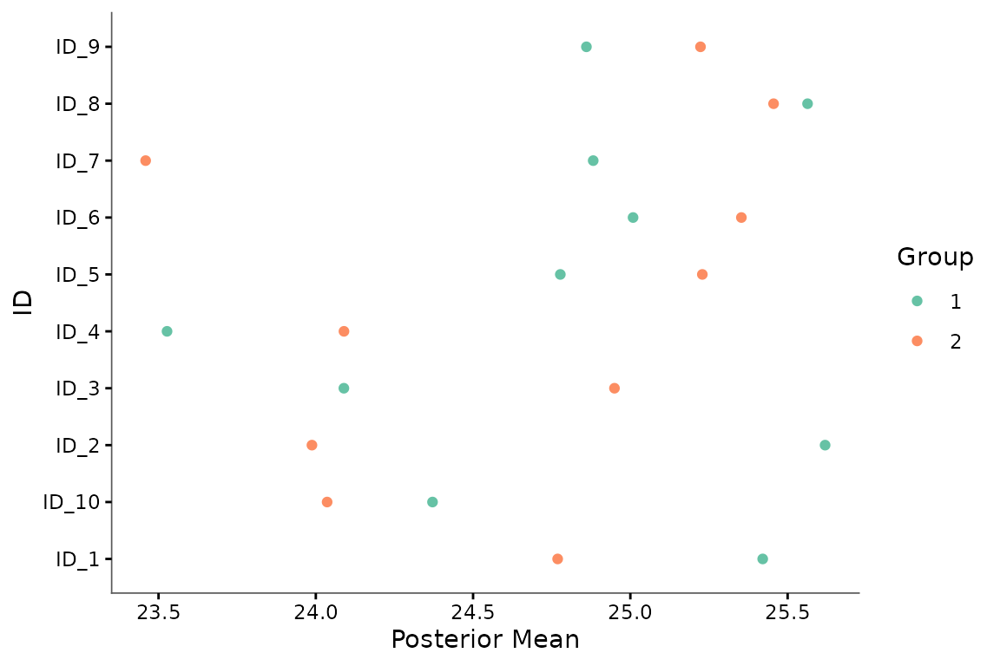
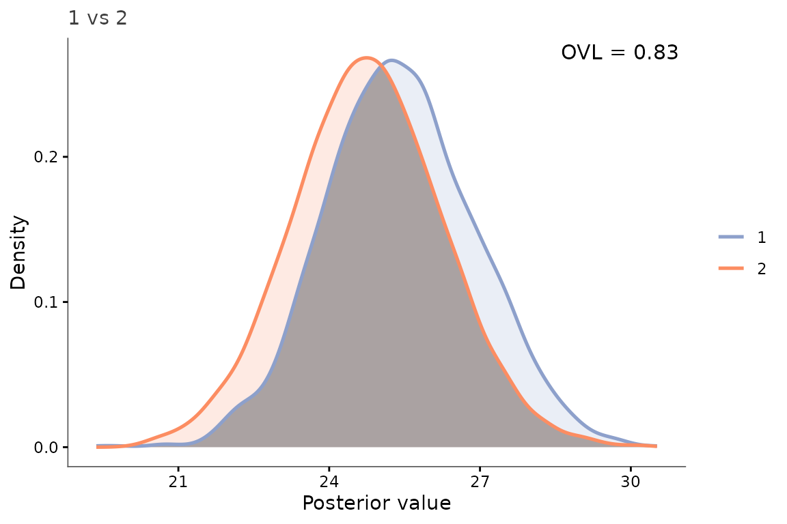

# Get started with BayesOmics

``` r

library(keRnel)
library(BayesOmics)
library(ggplot2)
```

The BayesOmics package provides a suite of tools for performing Bayesian
kernel-based differential analysis.

## Data format

Every function in BayesOmics expects a long-format data frame with these
columns:

| Column     | Meaning                                                       |
|------------|---------------------------------------------------------------|
| `ID`       | Feature identifier (e.g. a peptide, a CpG site, a metabolite) |
| `Group`    | Experimental condition the observation belongs to             |
| `Sample`   | Replicate identifier within a group                           |
| `Input_ID` | Which Input dimension a row belongs to (see below)            |
| `Input`    | The covariate the kernel operates on (e.g. genomic position)  |
| `Output`   | The observed measurement                                      |

A single-covariate analysis (the case throughout this vignette) has one
`Input_ID` value per feature; a data frame with just `Input` (no
`Input_ID`) also works unchanged – BayesOmics fills in `Input_ID`
automatically. A multi-dimensional Input (several covariates per
feature, e.g. genomic position *and* measurement time) instead has one
row per `Input_ID` value, with `Output` repeated identically across the
rows of one observation.

## Choosing and initializing a kernel

The kernel encodes which features should be treated as correlated. The
most common choice is the **Squared Exponential (SE) kernel**:

``` math
K_{\text{SE}}(x, x') = \sigma^2 \exp\!\left(-\frac{\|x - x'\|^2}{2\ell^2}\right)
```

where $`\sigma^2`$ is the signal variance and $`\ell`$ is the length
scale - how far apart two features can be before their correlation
becomes negligible.

Create an SE kernel and set its hyperparameters to the values that will
be used to generate synthetic data:

``` r

kern_true <- variance_kernel(variance = 10) * se_kernel(length_scale = 80)
```

## Simulating data

[`simu_db_kernel()`](https://terenceviellard.github.io/BayesOmics/reference/simu_db_kernel.md)
generates a dataset whose cross-feature covariance matches the
generative model assumed by
[`posterior_mean()`](https://terenceviellard.github.io/BayesOmics/reference/posterior_mean.md):
for each group, the vector of outputs across all features is drawn
jointly from a multivariate normal whose covariance is given by the
kernel, plus independent measurement noise. Each replicate is an
independent draw from that same distribution:

``` math
y_n \mid \mu_g \sim \mathcal{N}(\mu_g,\; \Sigma_\theta + \sigma^2 I),
```

``` r

set.seed(42)
data <- simu_db_kernel(
  kernel      = kern_true,
  nb_id       = 10,
  nb_group    = 2,
  nb_sample   = 8,
  diff_group  = 0.8,
  var_sample  = 5,
  range_input = c(0, 200)
)
head(data)
#>     ID Group Sample Input_ID     Input   Output
#> 1 ID_1     1      1        1 182.96121 24.58898
#> 2 ID_2     1      1        1 187.41508 29.09520
#> 3 ID_3     1      1        1  57.22791 24.94038
#> 4 ID_4     1      1        1 166.08953 31.75284
#> 5 ID_5     1      1        1 128.34910 27.42014
#> 6 ID_6     1      1        1 103.81919 30.37618
```

## Combining kernels: adding a Noise term

Kernels can be combined with `+` (additive) or `*` (product). Adding a
`NoiseKernel` nugget to absorb feature-level measurement noise
independently of the spatial signal is not just a nice-to-have here:
with realistic sample sizes, fitting a spatial kernel *alone* to noisy
data tends to produce an almost-singular covariance matrix (see the note
further down), which silently breaks the differential-analysis step.
Always fit and reuse the combined kernel, not just its spatial part:

``` r

se_part    <- variance_kernel(variance = 1) * se_kernel(length_scale = 1)
noise_part <- white_noise_kernel(noise = 1)
kern       <- se_part + noise_part
```

Using an SE + Noise kernel for optimization separates the spatial signal
($`\sigma^2`$, $`\ell`$) from the measurement noise ($`c`$).

## Optimizing hyperparameters

[`optim_hp()`](https://terenceviellard.github.io/BayesOmics/reference/optim_hp.md)
fits all hyperparameters by maximizing the marginal likelihood of the
output values.

``` r

groupe1=data[data$Group == unique(data$Group)[1], ]
prior_mean   <- mean(groupe1$Output)

hp_opt <- optim_hp(kern, groupe1, prior_mean = prior_mean, prior_cov = 1)
hp_opt
#>     variance length_scale        noise 
#>    15.524043    98.495702     4.491037 
#> attr(,"convergence")
#> [1] 0
#> attr(,"value")
#> [1] 203.0034
```

`length_scale` (~ 98) lands in the same ballpark as its simulation value
(80), confirming that correlation extends over most of the 200-unit
axis. `variance` (~ 15.5) and `noise` (~ 4.5) partially trade off
against each other with only 8 replicates per group – their individual
values are less tightly recovered than `length_scale` – but that is not
a problem: what matters for the next step is fitting *both* together, so
the resulting covariance correctly separates spatial signal from
measurement noise.

Update the kernel with the fitted values, **keeping both the spatial and
noise hyperparameters**:

``` r

kern_opt <- do.call(kupdate, c(list(kern), as.list(hp_opt)))
```

Do not rebuild a plain SE kernel from only `variance` and `length_scale`
here, discarding `noise`. With this many features and a length scale
this large relative to the input range, a pure-SE kernel matrix is
nearly singular (its condition number can exceed 1e9). The differential
analysis below still runs on such a matrix, but the resulting overlap
coefficient becomes numerically meaningless – typically collapsing to
exactly 0 regardless of the true difference between groups. Keeping the
fitted `noise` term is what keeps the covariance well-conditioned.

## Computing posteriors

[`posterior_mean()`](https://terenceviellard.github.io/BayesOmics/reference/posterior_mean.md)
applies the Normal-Normal conjugate update to every group at once:

``` math
p(\boldsymbol{\mu} \mid y_1, \dots, y_N,\, \Sigma_{\hat\theta})
= \mathcal{N}\!\left(
    \boldsymbol{\mu};\;
    \frac{\lambda_0\,\mu_0 + \sum_{n=1}^N y_n}{N + \lambda_0},\;
    \frac{1}{N + \lambda_0}\,\Sigma_{\hat\theta}
  \right)
```

where $`\Sigma_{\hat\theta}`$ is the kernel matrix at the optimized
hyperparameters, $`\mu_0`$ and $`\lambda_0`$ are the prior mean and
precision, and $`N`$ is the number of replicates.

``` r

posterior <- posterior_mean(data, kern_opt, mu_0 = prior_mean, lambda_0 = 1)
print(posterior)
#> <BayesOmics posterior> 2 group(s), 1 cached kernel matrix/matrices
#> 
#> -- Group 1 (10 IDs) --
#> Posterior mean:
#>   ID_1  ID_10   ID_2   ID_3   ID_4   ID_5   ID_6   ID_7   ID_8   ID_9 
#> 25.401 24.406 25.633 24.114 23.551 24.798 25.055 24.908 25.574 24.904 
#> Posterior covariance:
#>        ID_1 ID_10  ID_2  ID_3  ID_4  ID_5  ID_6  ID_7  ID_8  ID_9
#> ID_1  2.224 1.575 1.723 0.764 1.700 1.479 1.249 1.616 0.492 1.504
#> ID_10 1.575 2.224 1.544 1.201 1.670 1.711 1.606 1.721 0.882 1.717
#> ID_2  1.723 1.544 2.224 0.720 1.685 1.441 1.203 1.588 0.457 1.467
#> ID_3  0.764 1.201 0.720 2.224 0.936 1.329 1.542 1.135 1.645 1.299
#> ID_4  1.700 1.670 1.685 0.936 2.224 1.603 1.412 1.694 0.636 1.621
#> ID_5  1.479 1.711 1.441 1.329 1.603 2.224 1.672 1.693 1.015 1.724
#> ID_6  1.249 1.606 1.203 1.542 1.412 1.672 2.224 1.565 1.272 1.659
#> ID_7  1.616 1.721 1.588 1.135 1.694 1.693 1.565 2.224 0.817 1.703
#> ID_8  0.492 0.882 0.457 1.645 0.636 1.015 1.272 0.817 2.224 0.983
#> ID_9  1.504 1.717 1.467 1.299 1.621 1.724 1.659 1.703 0.983 2.224
#> 
#> -- Group 2 (10 IDs) --
#> Posterior mean:
#>   ID_1  ID_10   ID_2   ID_3   ID_4   ID_5   ID_6   ID_7   ID_8   ID_9 
#> 24.756 24.018 23.944 24.942 24.095 25.204 25.346 23.415 25.451 25.214 
#> Posterior covariance:
#>        ID_1 ID_10  ID_2  ID_3  ID_4  ID_5  ID_6  ID_7  ID_8  ID_9
#> ID_1  2.224 1.575 1.723 0.764 1.700 1.479 1.249 1.616 0.492 1.504
#> ID_10 1.575 2.224 1.544 1.201 1.670 1.711 1.606 1.721 0.882 1.717
#> ID_2  1.723 1.544 2.224 0.720 1.685 1.441 1.203 1.588 0.457 1.467
#> ID_3  0.764 1.201 0.720 2.224 0.936 1.329 1.542 1.135 1.645 1.299
#> ID_4  1.700 1.670 1.685 0.936 2.224 1.603 1.412 1.694 0.636 1.621
#> ID_5  1.479 1.711 1.441 1.329 1.603 2.224 1.672 1.693 1.015 1.724
#> ID_6  1.249 1.606 1.203 1.542 1.412 1.672 2.224 1.565 1.272 1.659
#> ID_7  1.616 1.721 1.588 1.135 1.694 1.693 1.565 2.224 0.817 1.703
#> ID_8  0.492 0.882 0.457 1.645 0.636 1.015 1.272 0.817 2.224 0.983
#> ID_9  1.504 1.717 1.467 1.299 1.621 1.724 1.659 1.703 0.983 2.224
```

Draw samples from the posteriors for plotting and the overlap
calculation:

``` r

samples <- sample_posterior(posterior, n = 2000)
```

## Differential analysis

[`calculate_group_overlaps()`](https://terenceviellard.github.io/BayesOmics/reference/calculate_group_overlaps.md)
returns the pairwise Overlapping Coefficient (OVL) between every pair of
groups. Groups with different sample sizes are fully supported - see
[`vignette("sample_size_scenarios")`](https://terenceviellard.github.io/BayesOmics/articles/sample_size_scenarios.md)
for a detailed exploration of how replicate counts affect posterior
width and the resulting OVL. OVL = 1 means identical posteriors (no
differential signal); OVL ~ 0 means fully separated profiles (strong
differential signal):

``` math
\text{OVL} = 2\,\Phi\!\left(-\tfrac{\delta}{2}\right)
```

where $`\delta`$ is the Mahalanobis distance between the two groups’
posterior means under the posterior covariance of the reference group,
and $`\Phi`$ is the standard normal CDF.

``` r

calculate_group_overlaps(posterior)
#>           1         2
#> 1 1.0000000 0.1217735
#> 2 0.1217735 1.0000000
```

Overlapping coefficient can be seen as a single-number summary of the
differential signal on the whole region of interest. It is useful for
ranking features, but it is sensible to curse of dimensionality: the
more features you include, the more likely it is that the joint overlap
will be low. The OVL is a global measure, and it does not tell you which
features are driving the difference.
[`compute_multi_diff()`](https://terenceviellard.github.io/BayesOmics/reference/compute_multi_diff.md)
complements the single OVL number with an uncertainty-aware breakdown:
from the posterior draws, it computes the empirical distribution of the
number of features for which group 1’s draw exceeds group 2’s, and (when
given `results`) attaches the same OVL computed above for reference.
[`plot_multi_diff()`](https://terenceviellard.github.io/BayesOmics/reference/plot_multi_diff.md)
turns this into a compact figure – one panel per group pair, titled with
that pair’s OVL, plus the posterior-mean panel already seen above:

``` r

multi_diff <- compute_multi_diff(samples, results = posterior)
multi_diff$Diff_proba
#> # A tibble: 11 × 5
#>    Group1 Group2 Nb_id  Proba Cumul_proba
#>    <chr>  <chr>  <int>  <dbl>       <dbl>
#>  1 1      2          0 0.077        0.077
#>  2 1      2          1 0.089        0.166
#>  3 1      2          2 0.086        0.252
#>  4 1      2          3 0.0825       0.334
#>  5 1      2          4 0.0925       0.427
#>  6 1      2          5 0.0895       0.516
#>  7 1      2          6 0.0795       0.596
#>  8 1      2          7 0.088        0.684
#>  9 1      2          8 0.0965       0.780
#> 10 1      2          9 0.0965       0.877
#> 11 1      2         10 0.123        1
```

``` r

plot_multi_diff(multi_diff)
```


The bar-chart panel is spread broadly across 0 to 10 features, rather
than spiked at either extreme – group 1 does not exceed group 2 on every
feature, nor on none. This is consistent with a real, but partial and
non-caricatural, differential signal: exactly the kind of nuance the
single OVL number above cannot show on its own.

## Individual feature plots

[`plot_posterior_mean()`](https://terenceviellard.github.io/BayesOmics/reference/plot_posterior_mean.md)
shows the posterior mean at every feature, coloured by group - useful to
see which features drive the differential signal:

``` r

plot_posterior_mean(samples)
```



[`plot_posterior_overlap()`](https://terenceviellard.github.io/BayesOmics/reference/plot_posterior_overlap.md)
overlays both groups’ posterior densities for one feature and shades the
region of overlap, giving a visual counterpart of the OVL coefficient:

``` r

plot_posterior_overlap(samples,
                       group1 = unique(samples$Group)[1],
                       group2 = unique(samples$Group)[2],
                       id     = unique(samples$ID)[1])
```



## Go further

| Vignette | What you will find |
|----|----|
| [`vignette("omics-analysis")`](https://terenceviellard.github.io/BayesOmics/articles/omics-analysis.md) | Full worked examples - realistic biological context, kernel composition (SE + Noise), HP interpretation, two-group and four-group dose-response designs, and every plot function. |
| [`vignette("sample_size_scenarios")`](https://terenceviellard.github.io/BayesOmics/articles/sample_size_scenarios.md) | How unbalanced designs affect posterior width and the OVL, and why the comparison remains valid with strongly unequal sample sizes. |
| [`vignette("troubleshooting")`](https://terenceviellard.github.io/BayesOmics/articles/troubleshooting.md) | Exact error messages you may encounter, what causes each of them, and the targeted fix. |
