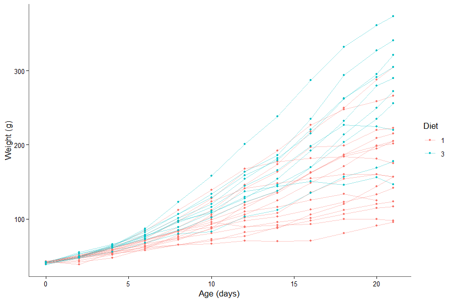
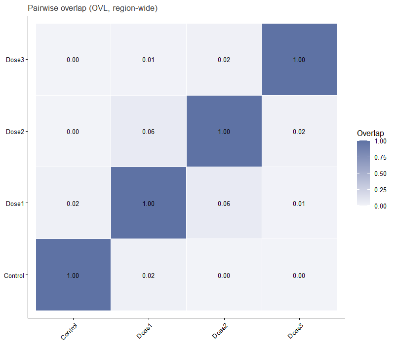
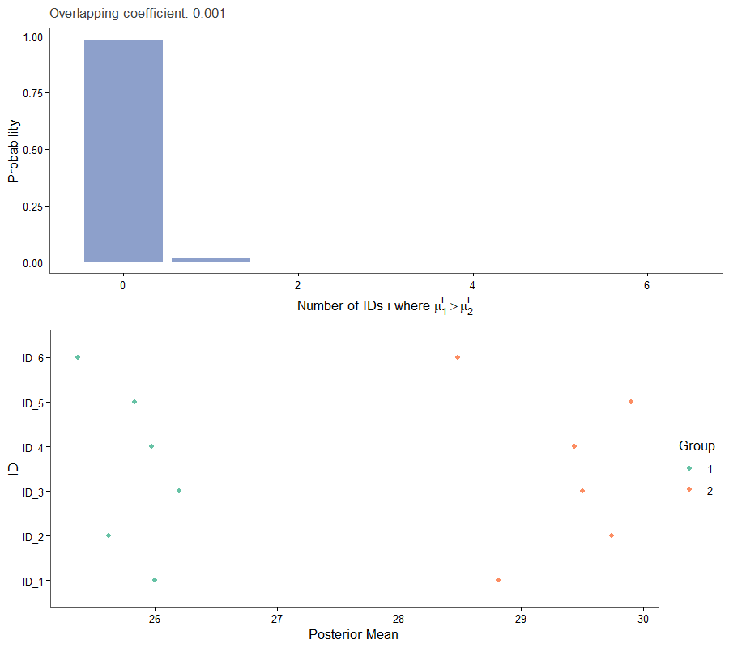

# BayesOmics

BayesOmics is an R package for Bayesian differential analysis of omics
data. It places a kernel over the feature dimension (genomic position,
mass-to-charge ratio, retention time, …) to capture correlation
structure, fits that kernel by maximum likelihood, and computes a
posterior profile per group. Groups are then compared as complete
multivariate profiles via an overlapping coefficient (OVL), giving a
single, interpretable differential-analysis statistic per region.

The analysis runs in four steps: simulate or load the data, fit the
kernel hyperparameters, compute one posterior per group, then compare
the groups with a distance between posteriors (OVL or normalised
Wasserstein).

## When to use BayesOmics

BayesOmics is designed for datasets where features are not independent
but share a meaningful ordering or distance along some axis — genomic
position, retention time, dose level, time point, m/z ratio, or any
other continuous covariate. Classical per-feature tests (t-test, limma)
ignore that structure and multiply the number of comparisons. BayesOmics
instead models the whole region jointly: it fits a kernel over the
feature axis to capture the correlation pattern, then derives one
posterior profile per group and compares groups as complete multivariate
objects via a single overlapping coefficient (OVL).

Typical use cases:

- **Longitudinal / time-course** omics: features ordered by time point
  or dose
- **Spatial genomics**: features ordered by chromosomal position
  (methylation, ChIP-seq, ATAC-seq)
- Any experiment where the signal is expected to vary smoothly across
  the feature axis

## Key assumptions

- Groups measured at the **same set of Input values** (same feature
  positions) share one kernel matrix, which allows the exact closed-form
  OVL; otherwise the OVL is estimated by Monte Carlo automatically.
- Within a group, every feature (`ID`) must have the **same number of
  replicates** (`Sample`).
- Groups being compared must cover the **same set of IDs**.Groups may
  have different numbers of replicates.

See
[Troubleshooting](https://terenceviellard.github.io/BayesOmics/articles/troubleshooting.html)
for the exact error raised when these conditions are not met.

## Explore the documentation

[**1 - Simulate or
load**  
Build the long-format table from a simulation or your
data.](https://terenceviellard.github.io/BayesOmics/articles/03_real_data.html)

[**2 - Fit the
kernel**  
Choose a kernel and learn its hyperparameters from the
data.](https://terenceviellard.github.io/BayesOmics/articles/08_kernel_choice.html)

[**3 - Compare
groups**  
Posteriors and distances between them, for two groups or
many.](https://terenceviellard.github.io/BayesOmics/articles/05_multi_group.html)

[**4 - Visualize**  
The key figures at a glance, each linking to its
article.](https://terenceviellard.github.io/BayesOmics/articles/gallery.html)

New to the model? Read
[Concepts](https://terenceviellard.github.io/BayesOmics/articles/concepts.html)
first, then the [Basic
pipeline](https://terenceviellard.github.io/BayesOmics/articles/01_basic_pipeline.html).
The full function list is in the
[Reference](https://terenceviellard.github.io/BayesOmics/reference/index.html).

## Installation

``` r

# install.packages("pak")
pak::pak("terenceviellard/BayesOmics")
```

## Dependencies

BayesOmics depends on the companion package
[**keRnel**](https://github.com/terenceviellard/keRnel) for kernel
classes, pairwise kernel computation, and hyperparameter management.
Both packages are installed together via
`pak::pak("terenceviellard/BayesOmics")`.

CRAN dependencies: `mvtnorm`, `ggplot2`, `dplyr`, `gridExtra`.

## Go further

| Vignette | What you will find |
|----|----|
| [01 Basic pipeline](https://terenceviellard.github.io/BayesOmics/articles/01_basic_pipeline.html) | The complete two-group walkthrough - kernel choice, hyperparameter fitting, posterior computation, [`group_diff()`](https://terenceviellard.github.io/BayesOmics/reference/group_diff.md). |
| [05 More than two groups](https://terenceviellard.github.io/BayesOmics/articles/05_multi_group.html) | Reading a [`group_diff()`](https://terenceviellard.github.io/BayesOmics/reference/group_diff.md) matrix and [`plot_multi_diff()`](https://terenceviellard.github.io/BayesOmics/reference/plot_multi_diff.md) output for more than two groups (e.g. a dose-response design). |
| [07 Unequal sample sizes](https://terenceviellard.github.io/BayesOmics/articles/07_unequal_sample_size.html) | How unbalanced designs affect posterior width and the OVL, and why the comparison remains valid with unequal sample sizes. |
| [Troubleshooting](https://terenceviellard.github.io/BayesOmics/articles/troubleshooting.html) | Exact error messages you may encounter, what causes each of them, and the targeted fix. |
