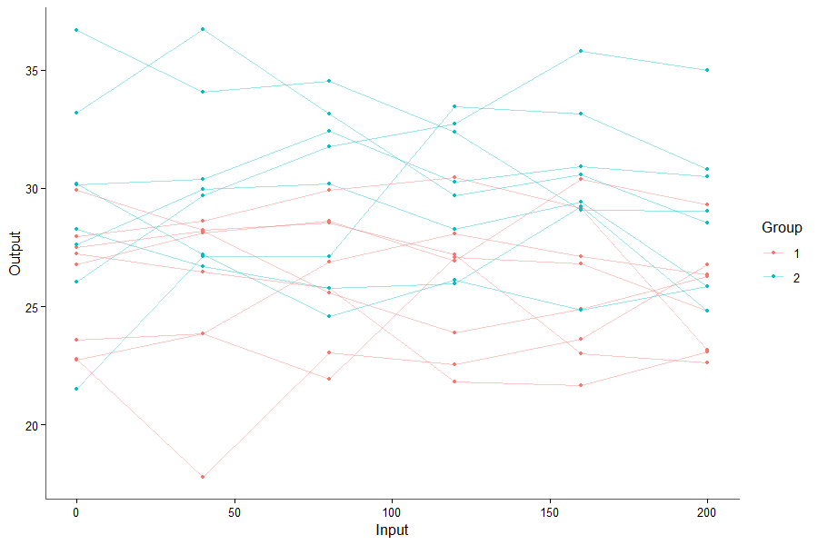
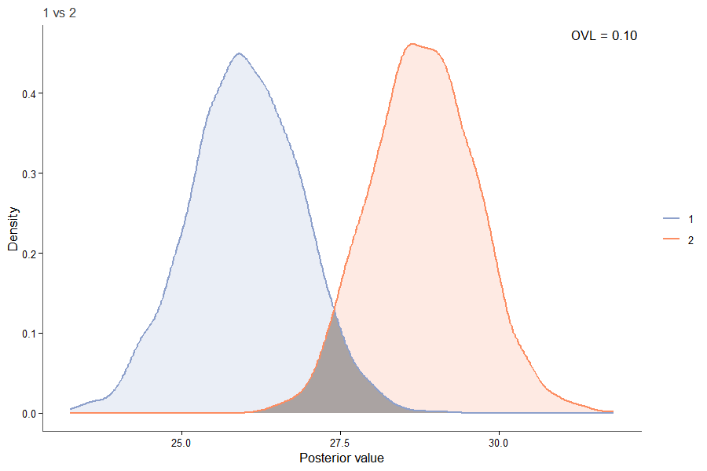
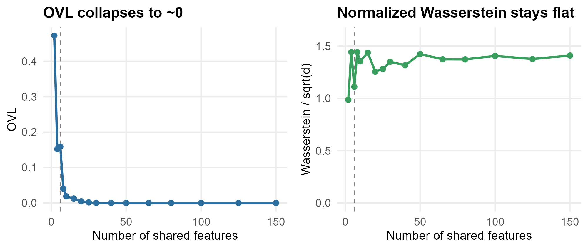
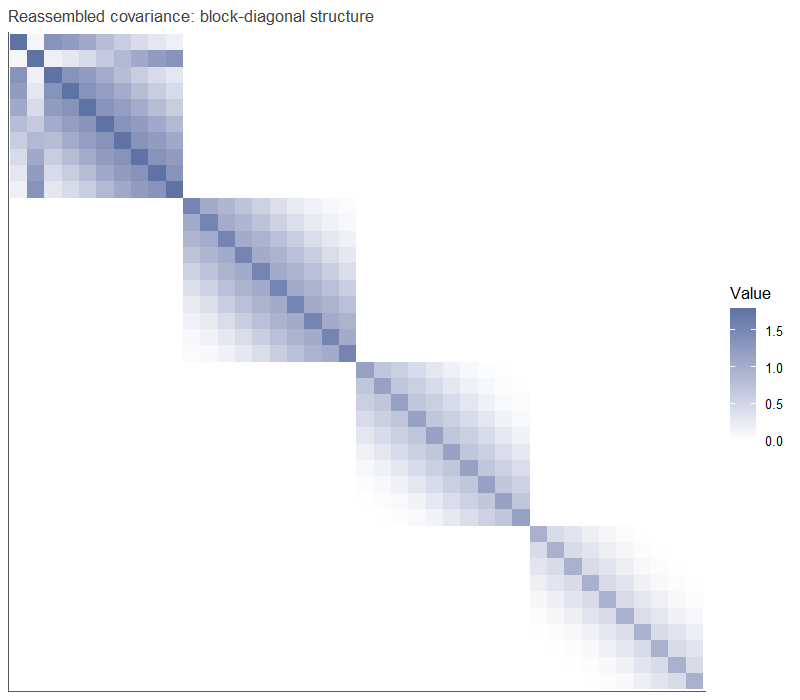

Click a figure to open the article where it is built and explained.

<strong>Replicates by group</strong> Raw data, one line per replicate. <a href="01_basic_pipeline.html">Basic pipeline</a>

<strong>Posterior overlap, one feature</strong> The shaded area is the OVL. <a href="01_basic_pipeline.html">Basic pipeline</a>

<strong>How many features differ?</strong> Two-group summary with posterior means. <a href="01_basic_pipeline.html">Basic pipeline</a>

<strong>Four groups at a glance</strong> Pairwise overlap heatmap. <a href="05_multi_group.html">More than two groups</a>

<strong>OVL vs. Wasserstein</strong> Same effect, growing number of features. <a href="06_metric_choice.html">Choosing a metric</a>

<strong>Real data</strong> Chick growth by diet, reshaped into the long format. <a href="03_real_data.html">Real data</a>

<strong>A 2D kernel as a Kronecker product</strong> Why multi-dimensional inputs need no new code. <a href="09_multi_dim_input.html">Multi-dimensional input</a>

<strong>Block-diagonal covariance</strong> What splitting into blocks gives up, and gains. <a href="10_block_diagonal.html">Block-diagonal partition</a>

